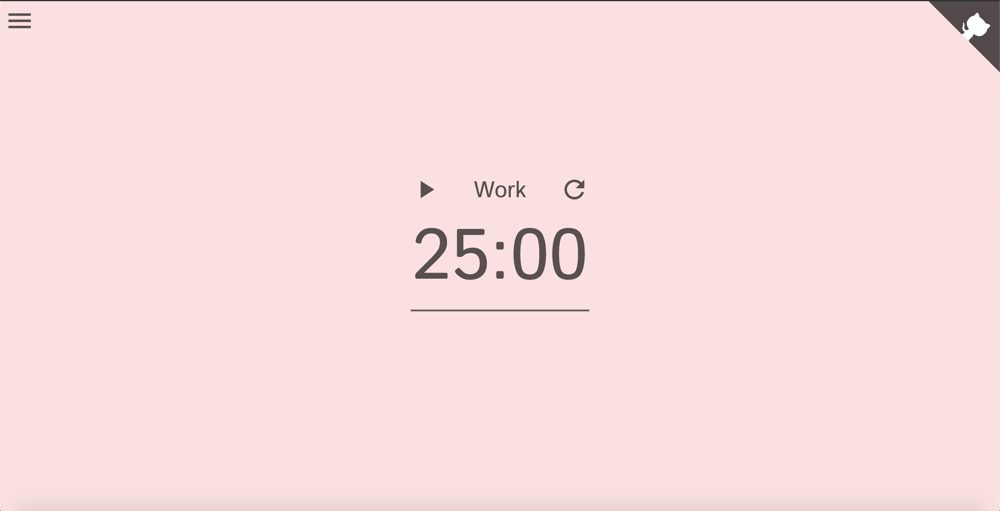

# Pomodoro

This is a tool to help manage your time and get the most out of it!

**_Pomodoro Technique_**: The [Pomodoro Technique](https://en.wikipedia.org/wiki/Pomodoro_Technique) is a time management system where you work for a period of time then take a short break, then work for a period of time then take a short break, and so on.

> **Home page**

# 

## Table of contents

1. [Demo](#demo)
2. [Technologies](#technologies)
3. [Features](#features)

## Demo

Here is the working live demo:
[https://jkarjoo.github.io/pomodoro/](https://jkarjoo.github.io/pomodoro/).

## Technologies

- Javascript (ES6)

## Features

- Adjust work/break times
- Stop/start timer
- Reset timer
- Notification when it is time to take a break
